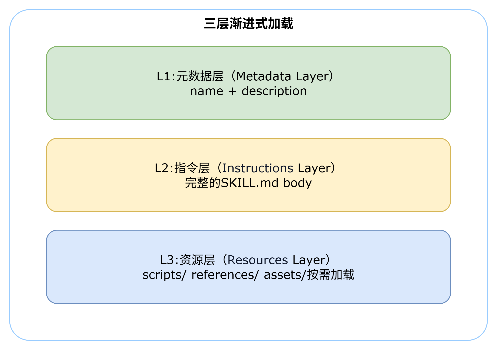
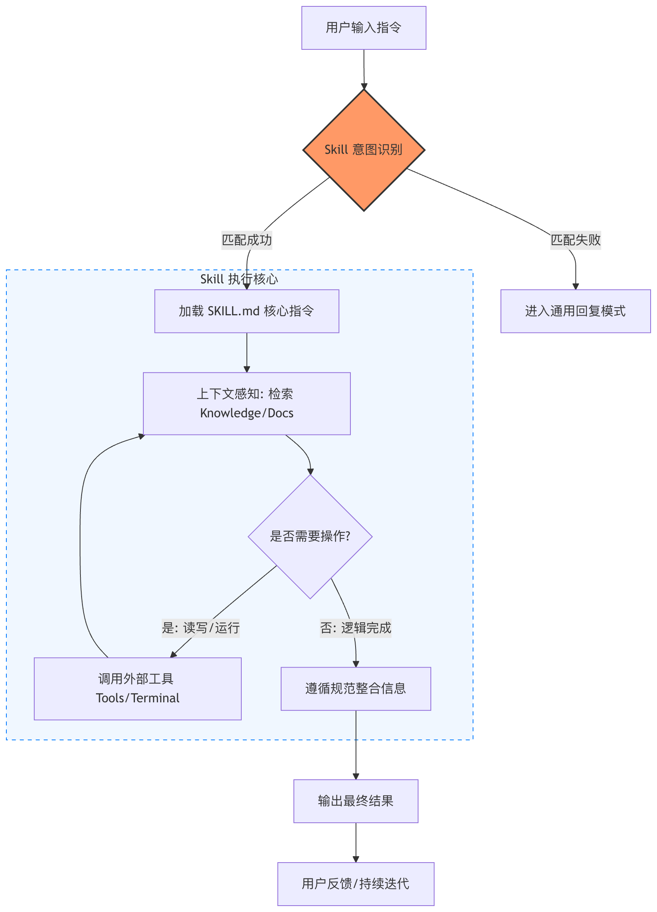
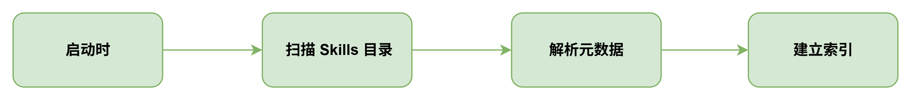
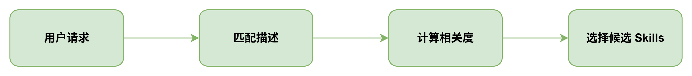
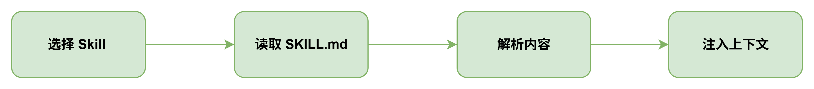
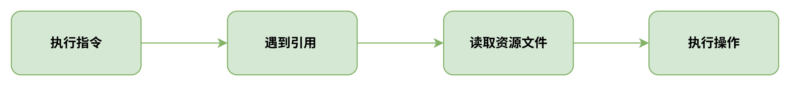
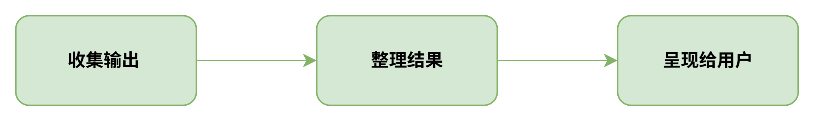

# 一、三层披露架构

| 层级     | 内容组成                    | 加载时机  | Token消耗 | 用途 |
|--------|-------------------------|-------|---------|----|
| 元数据层 1 | YAML元数据中的name和description | 会话启动时 |   约 50-100 tokens      |  快速判断 Skill 相关性  |
| 指令层    |     完整的 SKILL.md 文件     |  任务匹配时     |  通常 < 5000 tokens       |  提供详细的使用指导  |
| 资源层    |      脚本、文档、模板等资源文件                   |  需加载     |  无固定限制       |  提供执行所需的实际资源  |

> Level 1：元数据（始终加载）

元数据就像是 Skill 的“名片”，里面有名称（name）和描述（description），是用 YAML 格式来定义的。
Claude 在启动的时候，会把所有已经安装的 Skill 的元数据都加载进来，这样它就能知道每个 Skill 有什么用、什么时候该用。
因为元数据很轻量，所以你可以安装很多 Skill，不用担心把上下文占满。

> Level 2：说明文档（触发时加载）

SKILL.md 文件的正文就是说明文档，里面有工作流程、最佳实践和操作指南。
只有用户的请求和 Skills 元数据里的描述相符时，Claude 才会用 bash 指令读取这份文档，把内容加载到上下文里。
这种“触发式加载”能保证只有相关的详细指令才会消耗 Token。

> Level 3：资源与代码（按需加载）

Skills 还能打包一些更深入的资源，比如更详细的说明文档（FORMS.md）、可执行脚本（.py）或者参考资料（像 API 文档、数据库结构等）.
Claude 只有在需要的时候，才会通过 bash 去读取或执行这些文件，而且脚本代码本身不会进入上下文。
这样一来，Skills 就能捆绑大量信息，几乎不会增加额外的上下文成本。

# 二、 渐进式披露机制工作流程

## 1. 初始发现

## 2. 相关性评估

## 3. 指令加载

## 4. 资源按需加载

## 5. 结果整合

